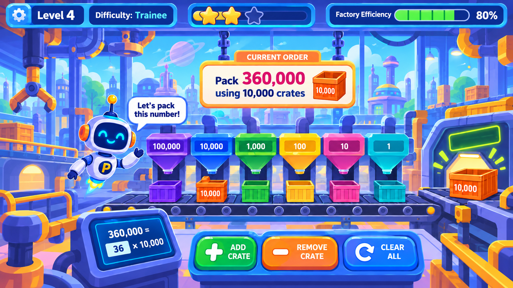
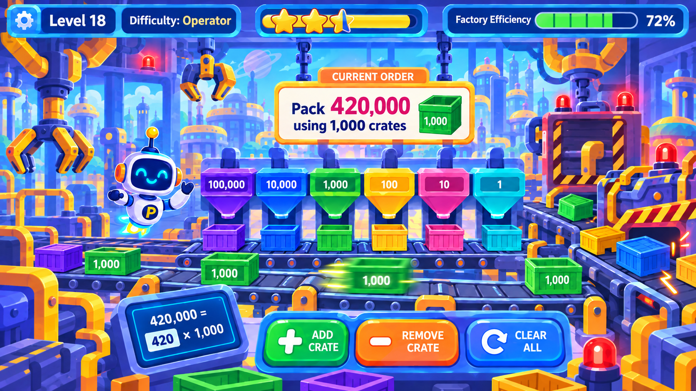
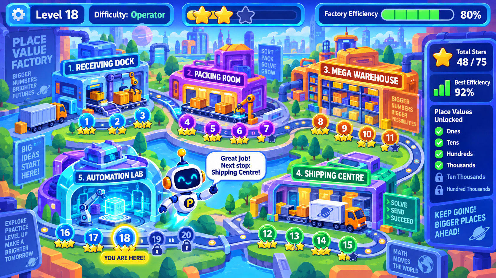
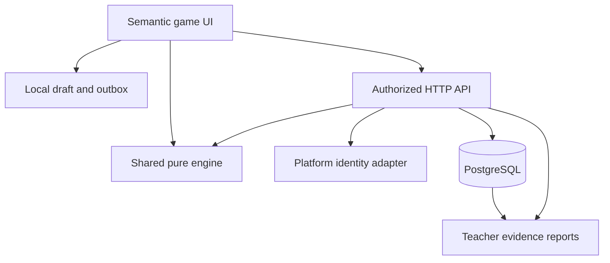
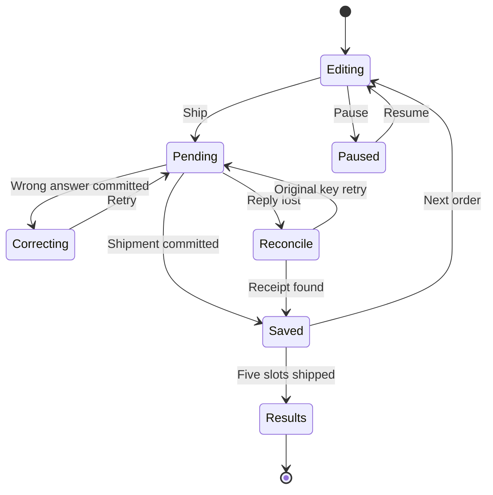
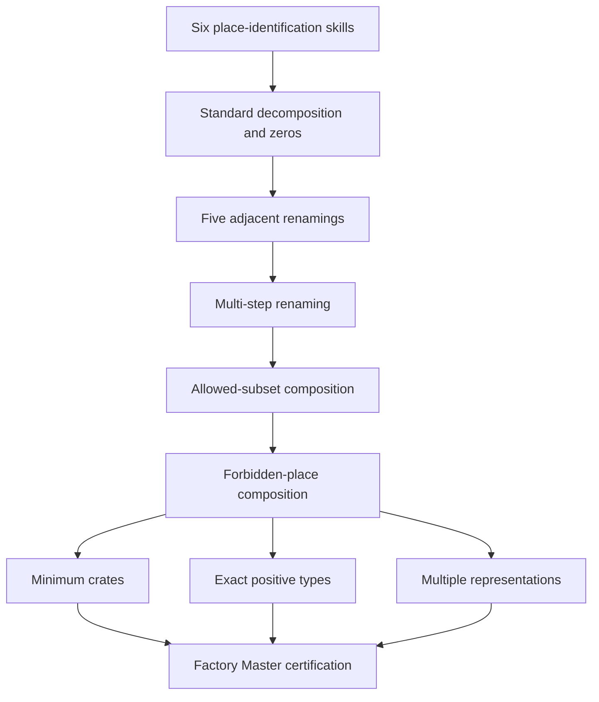
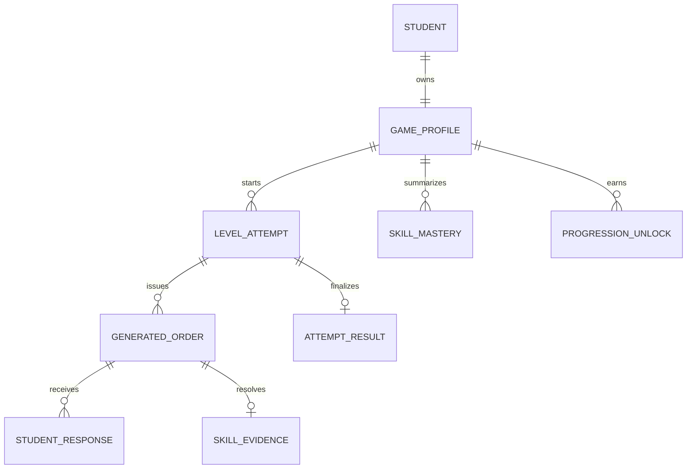

# PLACE VALUE FACTORY

## V1 Product + Technical Specification

Prepared for Mathieu Doucet • Grade 5 • 20 September 2026 • Version 1.0

**IMPLEMENTATION BASELINE: SPECIFICATION ONLY. No application has been implemented by this handoff.**

## Contents

- 01 | Charter, authority and handoff status
- 02 | Scope and learning principles
- 03 | Visual system and image authority
- 04 | Gameplay loop, controls and teaching actions
- 05 | Student access, map and level introduction
- 06 | Help, results, progress and settings
- 07 | Six mathematical stages and certifications
- 08 | Concrete V1 level map
- 09 | Generation and solvability algorithms
- 10 | Validation and minimum-crate reasoning
- 11 | Skill model and deterministic mastery
- 12 | Adaptation, scaffolding and evidence scheduling
- 13 | Factory efficiency, pressure and rewards
- 14 | Errors, feedback and misconception evidence
- 15 | Teacher workflow and exact report definitions
- 16 | Architecture and implementation baseline
- 17 | Relational data model and invariants
- 18 | API behavior and trust boundaries
- 19 | Persistence, reconnect and two-tab policy
- 20 | Accessibility and responsive behavior
- 21 | Child data, authentication and operations
- 22 | Required mathematical and systems test plan
- 23 | Acceptance register and release evidence
- 24 | Development roles and dependency-ordered roadmap
- 25 | Architecture, state and skill diagrams
- 26 | Sources, decisions and first implementation action
- Appendix A | AGENTS.md
- Appendix B | PROJECT_STATUS.md
- Appendix C | TASK_LOG.md
- Appendix D | DECISIONS.md
- Appendix E | API_CONTRACTS.md


# 01 | Charter, authority and handoff status

Place Value Factory is a Grade 5 number-building game for Mathieu Doucet. Students operate a colourful factory, compose numbers using place-value crates, and learn to rename values when machines are unavailable. Mathematics drives the machinery: the student chooses quantities, sees their represented total and ships a valid order.

**Status: specification only.** This package contains design references, proposed implementation contracts and test fixtures. No application, authentication, database, endpoint or classroom deployment has been built or verified. Documentation checks are not application tests.

Version 1.0 • 20 September 2026. MUST identifies accepted product requirements. BASELINE identifies a concrete recommended implementation decision, usable for development unless replaced by a recorded decision. OPTIONAL items are outside the release gate. The requested six-stage progression, truthful mathematical feedback, one CURRENT ORDER panel, five development roles and evidence-based reporting are MUST requirements. Numerical mastery thresholds, 30 levels, five orders per level and the chosen stack are BASELINE decisions.

Authority order: owner instructions and accepted decisions; written mathematical/product rules; API_CONTRACTS.md for agreed interfaces; visual references for style. Decorative screenshot statistics never override mathematics. A contract conflict must be reconciled in both documents before code merges. The editable Markdown and PDF are generated from identical chapter content; the standalone root documents appear in full as appendices.

Read chapters 1-4, 10-19 and AGENTS.md first. Implementers then read their system chapters, API_CONTRACTS.md and the relevant full-resolution design image. QA traces acceptance IDs to actual evidence. The FrancoBot specification supplied the organization, screen-by-screen acceptance pattern, versioning and role coordination model; its voice, AI and pronunciation systems are deliberately not dependencies here.

Repository package: root coordination files and README; docs/ PDF and Markdown; design/ four original PNGs; tests/fixtures/ deterministic mathematical cases. Keep the PNG filenames intact. The ZIP has a Math_Factory/ root so it can be extracted and its contents placed in an existing repository without guessing paths.

# 02 | Scope and learning principles

V1 includes student and teacher access, minimal classes/rosters, a five-zone map with 30 short levels, all six mathematical stages, responsive semantic gameplay, deterministic generation/validation, persistence, skill evidence, adaptive practice, teacher reports, pause/help/accessibility and recovery. An order contains one target and explicit restrictions. Whole non-negative crates only; target range 0-999,999, with zero used in a deliberate tutorial/review fixture rather than normal random orders.

No LLM or OpenAI API is required. Exclude multiplayer, leaderboards, social feeds, chat, student email, ads, paid currency, loot boxes, a shop and FrancoBot integration. Exclude fractional crates, decimal place values, arbitrary coin denominations, finite crate inventories and a continuous physics simulation. Cosmetic conveyor activity does not constrain the mathematics. Crate shortages are represented by an explicitly unavailable denomination at order creation, never a hidden quantity cap.

Priority: mathematical correctness; Grade 5 usability; fun/replay; teacher usefulness; implementation simplicity; future platform compatibility. A correct unrestricted representation must ship even when it uses more crates. A specially stated minimum-crate challenge may require improvement, while explicitly acknowledging that the total is correct.

Every level targets approximately 3-5 minutes but has no time limit. Five orders is the default, and a student may stop and resume. Deliberation, keyboard use, reduced motion and disabled pressure cannot lower mastery or stars. Tutorials, supports and worked examples are available without reward deductions; evidence of independent success remains distinguished for instructional reporting.

The factory demonstrates equivalence: one large crate unfolds into ten crates of the next smaller denomination with the total held constant. Quantities above 20 render as a labelled batch plus a few representative crates, not hundreds of objects. The model must never imply that a visual batch contains only the visible sample count.

# 03 | Visual system and image authority

All four supplied PNGs were visually inspected at their native 1672 × 941 dimensions. Their upload timestamps do not establish design revision history. Therefore no filename suffix is treated as proof of approval chronology. BASELINE: use the calmer composition of game_screen.png for ordinary play and game_screen2.png for optional heightened activity; retain their shared one-panel hierarchy.

| File in design/ | Actual content and authority | Illustrative/conflicting content |
| --- | --- | --- |
| game_screen.png | Calm gameplay; robot left, central cream order panel, six machines, bottom controls and equation monitor | Level 4/Trainee conflicts with 360,000 ÷ 10,000 flexible task; orange 10,000 crate conflicts with blue machine; no Ship control |
| game_screen2.png | Same layout with dense conveyors, arms and warning lights; 420,000 using 1,000 is valid (420 crates) | Level 18/Operator and 72% are sample values; apparent equation is a filled answer, not default solution; unavailable machines are not visibly disabled |
| level_complete_screen.png | Celebration, robot, three stars, result cards, skill panel and next/retry/map actions | 12/12, 96%, tier unlock and percentages are invented sample data; do not reproduce without records |
| map_screen.png | Five distinct factory buildings and a curved route with level nodes; robot guide and progress sidebar | 20 visible nodes, 48/75 and locked large places are not V1 rules; six-digit work requires those places; efficiency is not a permanent math grade |

Palette baseline: hundred-thousands purple #7541D7; ten-thousands blue #1265D8; thousands green #11863D; hundreds amber #F5B51B; tens magenta #C5207D; ones cyan #00839B. Use matching crates, machines, icons and equation chips. Pair each colour with a numeric denomination, written name and a distinct emblem. White or navy foregrounds must be contrast-tested; these swatches are not prevalidated text colours.

Use navy #102653 for text, cream/white math panels, cobalt framing, rounded rectangular controls and restrained gradients. Student text starts at 18 CSS px; order target 40-56px desktop, 32px tablet; primary controls at least 48px high. Keep decoration behind opaque content surfaces. Robot speech is short and dismissible, never the sole instruction.

Rebuild semantic DOM controls with SVG/CSS machinery. Do not use flattened screenshots as application backgrounds containing embedded controls. Decorative scenery assets may be original static art; actual numbers, quantities, meters and buttons remain live. No copyrighted studio characters or copied branding. Log asset provenance in the future asset manifest.

DESIGN-01: each reference has a semantic implementation and this authority mapping. DESIGN-02: all six denominations have consistent colour and non-colour labels. DESIGN-03: game contains exactly one CURRENT ORDER panel and no separate Orders panel. DESIGN-04: animated warning effects never obscure numbers or flash rapidly.








# 04 | Gameplay loop, controls and teaching actions

Arrival reveals target, mode, allowed/forbidden denominations and any extra objective. Start each new representation at zero; choose the largest available machine by default. All six machines stay visible. Unavailable ones have a lock icon and a readable reason. Clicking an unavailable machine explains the restriction and does not count as an attempted answer.

Machine selection changes the active quantity editor. Provide minus/plus one, optional ±10/±100 shortcuts, direct integer entry, Clear All with Undo and a permanent **Ship Order** action. Never require repeated clicking for 42, 185 or 420 crates. Invalid text remains an editable form error and is not educational evidence. Selected quantity appears beside its machine and in a complete representation ledger. Keyboard Tab follows reading order; Enter within a quantity commits its edit, while Ship is a separate focused button, preventing accidental submissions.

The monitor shows the student's current expression and computed total, initially zero, not the answer from a mockup. Show target separately; the difference is revealed on submission or explicit help rather than an automatic answer solver. After submission, distinguish underproduction, overproduction, packaging restriction and objective-not-yet-met. Preserve editable quantities for correction. A successful local check gives provisional feedback; a shipment is marked Saved only after server acknowledgment. Continue to the next order only after a committed successful response, simplifying recovery and preventing unsaved cascades.

A focused exchange action is introduced in Stage 3: select a loaded crate, choose Exchange, and convert one crate to ten of the adjacent smaller type when both are permitted. Never silently canonicalize flexible quantities on input. For a repacking task, display a read-only source decomposition and an empty destination; the unavailable source crate can be shown in the teaching area but cannot be shipped. Dragging is optional and has button equivalents.

On success animate at most 1.2 seconds of packaging; skip/reduced-motion replaces this with a static check. An explicit Continue action moves to the next order. Fifth successful order opens saved results; the completion endpoint is idempotent. A pause freezes animation and optional pressure, retains draft, and offers Resume, Settings and Save & Exit. No student is forced through a failure countdown.

GAME-01: full login-to-five-shipments-to-results flow works. GAME-02: entering 420 makes 420 thousand-crates immediately. GAME-03: exchanges preserve represented total. GAME-04: correction preserves all chosen quantities. GAME-05: locked machines cannot be shipped. GAME-06: saving and pending states are distinguishable. GAME-07: no action requires drag, speed or sound.

# 05 | Student access, map and level introduction

| Screen / route | Required behavior | Acceptance |
| --- | --- | --- |
| /student/login | Class code, username, masked six-digit PIN; labelled reveal; generic error; teacher help; no roster disclosure | LOGIN-01 valid fictional credentials open only own map; LOGIN-02 errors do not enumerate users; LOGIN-03 keyboard/reveal/throttle recovery work |
| /games/place-value-factory | Map from map_screen.png; current path level and achieved difficulty always visible; resume banner, unlocked/replay/locked nodes; list view alternative | MAP-01 nodes reflect committed progress after reload; MAP-02 keyboard/list reaches every available node; MAP-03 locked nodes explain next prerequisite |
| /games/place-value-factory/levels/:levelId | Goal, example different from live order, five orders, no deadline; restriction legend; selected calm/busy setting; Start or Resume | INTRO-01 no hidden restriction; INTRO-02 double Start returns one active attempt; INTRO-03 example cannot earn mastery |
| /games/place-value-factory/attempts/:attemptId | Gameplay described in chapter 4 | PLAY-01 route ownership enforced; PLAY-02 resume shows exact committed order and recoverable draft |

The map has five zones but six certifications; zones group related work rather than duplicating tiers. Sidebar shows stars out of 90, last completed level efficiency explicitly labelled as such, and certifications earned. Replace the misleading 'place values unlocked' list with 'Skills practiced'; no denomination is withheld when an assigned task needs it. Current Level means highest unlocked path node, not a grade. On replay the HUD shows the replayed level and retains earned certification, with a smaller 'Practicing: …' label if needed.

Loading uses skeletons without invented numbers. Empty profile starts at level 1/Trainee. Stale/offline map is labelled; a new level cannot start without the server. Unauthorized or removed access returns a neutral page and login/teacher-help route. Start creates a new attempt only when no active attempt exists; otherwise offer Resume or explicitly abandon the existing one.

# 06 | Help, results, progress and settings

Help dialog offers three deliberate steps: (H1) explain the relevant base-ten relationship without numbers from the solution; (H2) show a worked example with a different target; (H3) show one useful step or full model for the current target. Record highest step reached before each answer. Accessibility supports (read instruction, enlarge text, reduced motion, focus mode) are separate events and never counted as content hints. Closing returns focus and the unchanged draft.

For a minimum-crate task, H1 explains exchanging ten small crates for one allowed larger crate; H2 models another value; H3 may reveal the canonical answer. For exactly-k-types, explain 'type' as a denomination with quantity above zero. For two-representation tasks, display Representation A and B with tabs and a shared target; identical vectors in different edit orders are not different answers.

| Route/state | Content and behavior | Acceptance |
| --- | --- | --- |
| Pause / Help dialogs | Labelled title; focus trapped/restored; Escape closes; pressure stopped; no loss of edits | HELP-01 H1-H3 recorded once each; HELP-02 accessibility supports never reduce evidence weight; PAUSE-01 refresh can resume |
| /attempts/:id/results | level_complete_screen.png; committed order count, first-attempt fraction, corrected fraction, best streak, this-level efficiency, evidence-based skill statuses, earned stars; next/replay/map | RESULT-01 real counters only; RESULT-02 no completion without five resolved orders; RESULT-03 repeated finalize adds no awards |
| /games/place-value-factory/progress | skill families, emerging/developing/secure/needs-refresh, evidence counts and next suggested practice; no global ability score | PROGRESS-01 sparse evidence says 'Still gathering evidence'; PROGRESS-02 timing absent from certification calculation |
| /games/place-value-factory/settings | Sound off/on, reduced motion, calm/busy, text size, instruction reading when supported; save per profile | SETTINGS-01 keyboard usable; SETTINGS-02 calm mode changes no math/reward rule |

Results use fractions: 4/5 first try (80%), 5/5 eventually correct (100%). Do not use the mockup's 96% with 12 orders as a hardcoded statistic. A modelled completion says 'Completed with a worked example' without shame. Next Level shows only when unlocked; otherwise 'Practice for next room' starts targeted practice. Replay never removes prior stars. Best streak counts consecutive orders satisfying the whole objective on first submit, independent of content hints, and is motivational only.

# 07 | Six mathematical stages and certifications

| Stage / tier | Permitted mathematics | Introduction and pressure |
| --- | --- | --- |
| 1 Trainee | Single nonzero digit in its normal place; quantity 1-9; all six places introduced | One machine focus; no pressure; 40,000 = 4 × 10,000 |
| 2 Packer | Canonical base-ten decomposition; each quantity 0-9; grow from 2 to 6 active digits, intentional zeros | Full ledger and total; no pressure; 423,892 = [4,2,3,8,9,2] |
| 3 Converter | One allowed denomination dividing target exactly; quantities may exceed 9 | Batch entry, equivalence animation; optional busy visuals late in tier; 420,000 = 42 × 10,000 |
| 4 Specialist | Explicit allowed subset; any nonnegative equivalent vector allowed | Gaps in machinery and mixed renaming; optional busy visuals; 529,521 using 10,000/100/1 |
| 5 Supervisor | Explicit forbidden machines, remaining machines available | Same arithmetic as Stage 4, different reading/repacking demand; 458,123 without 100,000 and 100 |
| 6 Factory Master | Minimum crates, exactly k positive types, two distinct representations, combined restrictions | Number puzzles with optional pressure; no finite inventory or impossible combinations |

Stage 1-2 orders explicitly say 'Use normal place value: 0-9 crates of each size.' A mathematically equal flexible answer is acknowledged as equal but does not satisfy that declared task. Stage 3 only permits a single machine. Stages 4-5 must accept all valid representations; minimum count is a separate diagnostic unless explicitly required in Stage 6.

Correct examples: 350,000/10,000 = 35; 185,000/1,000 = 185; 24,600/100 = 246. The historic example 42,000 using only 10,000 is impossible with whole crates and must never be generated. Use 420,000/10,000 or 42,000/1,000 instead.

529,521 with 10,000/100/1: [0,52,0,95,0,21] is valid and uses 168 crates. This is minimal: 52 ten-thousands leave 9,521; 95 hundreds leave 21; the remaining 21 ones cannot be grouped into an allowed larger crate. Minimum count is 168. Another valid vector [0,51,0,195,0,21] uses 267 crates and must ship in ordinary restricted mode.

458,123 without 100,000 or 100: [0,45,8,0,12,3] = 458,123, using 68 crates. Show the real count, not the prompt's generic '63 crates' illustration. The canonical six-denomination vector would require forbidden hundreds and must not ship under this restriction.

# 08 | Concrete V1 level map

BASELINE: 30 levels, five orders per attempt, unlimited duration. Listed numbers are fixtures/examples; production uses constrained generation. Every level has five-slot coverage fixed in configuration so a random run cannot omit its required skill. Within slots, choose targets and difficulty bands adaptively. Practice attempts fill missing evidence without replacing required level coverage.

| Level | Zone / stage | Five-order blueprint and range |
| --- | --- | --- |
| 1 | Receiving / 1 | ones,tens,hundreds,ones,tens; single digit 1-9 × place |
| 2 | Receiving / 1 | thousands,ten-thousands,hundred-thousands,thousands,ten-thousands |
| 3 | Receiving / 1 | hundred-thousands,hundreds,ones,tens,thousands; mixed machine selection |
| 4 | Receiving / 1 | ten-thousands,hundred-thousands,ones,tens,hundreds; consolidation |
| 5 | Packing / 2 | 2 active digits, 10-9,999; identify both quantities |
| 6 | Packing / 2 | 3 active digits, 100-99,999 |
| 7 | Packing / 2 | 4-6 active digits, 10,000-999,999 |
| 8 | Packing / 2 | 2-4 active digits, internal zero in every target; 506,020 fixture |
| 9 | Packing / 2 | 2 trailing-zero targets, 2 internal-zero targets, 1 six-active-digit target |
| 10 | Warehouse / 3 | 5 × 100,000→10,000; quotient 10-99 |
| 11 | Warehouse / 3 | 5 × 10,000→1,000; quotient 10-99 |
| 12 | Warehouse / 3 | 5 × 1,000→100; quotient 10-99 |
| 13 | Warehouse / 3 | 5 × 100→10; quotient 10-99 |
| 14 | Warehouse / 3 | 5 × 10→1; quotient 10-99 |
| 15 | Warehouse / 3 | multi-step: target unit 1,000/100/10/1/1,000; quotient 100-999 |
| 16 | Shipping / 4 | allowed [100,1], [1,000,10], alternating; one skipped place, target ≤9,999 divisible by smallest |
| 17 | Shipping / 4 | allowed [10,000,100,1], [100,000,1,000,10]; target ≤999,999; use 2-3 active types |
| 18 | Shipping / 4 | five mixed subset orders; includes 529,521 blueprint; at least two missing places |
| 19 | Shipping / 5 | one forbidden interior type; targets whose standard form uses it |
| 20 | Shipping / 5 | two forbidden types; includes no 100,000/no 100 blueprint |
| 21 | Shipping / 5 | repack source standard form; five varying forbidden sets; no minimum requirement |
| 22 | Lab / 6 | fewest crates, all types; target 100-99,999 |
| 23 | Lab / 6 | fewest crates, allowed subsets; target 1,000-999,999 |
| 24 | Lab / 6 | exactly 2 positive crate types; constructive witness; target ≤99,999 |
| 25 | Lab / 6 | exactly 3 positive crate types; constructive witness; target ≤999,999 |
| 26 | Lab / 6 | two different vectors for same target; all machines |
| 27 | Lab / 6 | two different vectors under allowed subsets with a valid exchange |
| 28 | Lab / 6 | repack plus minimum; forbidden set fixed before order appears |
| 29 | Lab / 6 | five mixed objectives: min,exact2,exact3,two,ordinary restriction; optional rush scenery |
| 30 | Lab / 6 | same five objective families with six-digit targets; certification review |

Completion opens the next level within a stage. Stage boundaries (4→5, 9→10, 15→16, 18→19, 21→22) additionally require prerequisite evidence from chapter 11. If absent, show a positive practice route with the needed skills; never silently repeat an identical level. Completion of level 30 plus Stage 6 skill evidence awards Factory Master. Initial Trainee is onboarding status; subsequent tier is earned when the preceding stage's gate is met. Certifications do not disappear later.

Zones open with their first eligible level. Cosmetics unlock after completing the zone: new sign, crane, warehouse shelves, loading bay, lab glow; no stat advantage. Every replay uses a new stored seed and keeps best stars. The 90-star denominator is configured, not painted into an asset. Extending to 50-100 levels requires versioned blueprints, not frontend code changes.

Slot attribution: levels 5-7 target standard.decompose in all five slots; level 8 targets standard.zero; level 9 slots 1-4 target standard.zero and slot 5 standard.decompose. Levels 16-18 target compose.allowed, 19-21 compose.forbidden, 22-23 and 28 reason.minimum, 24-25 reason.exactTypes, 26-27 reason.multiple; levels 29-30 use the primary skill matching each stated objective. Optional transfer uses the final main slot primary skill. Stage 1 quantities use easy 1-3, medium 1-6, hard 1-9. A practice order uses the most recently unlocked blueprint for its selected skill; choose lowest level ID on ties.


# 09 | Generation and solvability algorithms

All arithmetic uses integer denominations D = [100000,10000,1000,100,10,1]. For any nonempty subset A of these powers of ten with unlimited crates, target T is representable iff T ≥ 0 and T mod min(A) = 0. This is sufficient because the smallest allowed crate alone can form T. This rule is specific to this denomination chain; do not generalize it to arbitrary currencies or quantity caps.

Store an immutable OrderSpec: id, attemptId, index, T, mode, allowed, forbidden, canonicalRequired, exactTypes nullable, distinctRepresentations (1 or 2), minimumRequired, skillIds, primarySkill, difficultyBand, generatorVersion, configVersion, seed and witness metadata server-side. Do not expose witness/minimum answer before help or validation. Allowed and forbidden must be consistent; intersect level constraints before generation. Forbid empty allowed sets. T=0 is only permitted in zero tutorials with no positive-type/two-solution objective.

Determinism baseline: use a 32-bit xorshift PRNG with nonzero uint32 seed; shifts (13,17,5), uint32 coercion after each operation. Map to inclusive integer ranges via floor((nextUint32 / 2^32) × range)+low. Seed 1 produces first value 270369. Never use Math.random or locale-sorted arrays. Sort denomination arrays descending and skill IDs lexically. Store the fully generated spec so historical replay does not depend on newer generator code.

Canonical generator: pick required magnitude and exact count of nonzero digit positions, sample digits 1-9 in those positions, leave all others zero. Require highest position nonzero. Internal-zero means a zero between highest and lowest nonzero positions; trailing-zero means at least one zero below the lowest nonzero digit. Check blueprint constraints after construction.

Single-unit generator: choose allowed denomination d, quotient q in the configured band, set T=q×d and reject if above 999,999. Adjacent renaming band q=10-99; multi-step q=100-999. The label 100,000→10,000 requires at least one hundred-thousand in the standard target. Record multi-step renaming separately rather than pretending a compound answer isolates every adjacent skill.

Restricted/forbidden generator: sample a valid witness vector using only allowed types; form T; then enforce magnitude, missing-place and digit constraints. Require a forbidden place's standard digit to be nonzero for a forbidden-place teaching order. Ordinary mixed subsets require at least two nonzero canonical allowed quantities; otherwise the question may accidentally collapse to single-unit work.

Minimum-crate generator: generate a representable ordinary target; calculate greedy minimum over allowed types. Exact-k generator: choose k allowed types, assign each positive quantities, set T; this constructive witness guarantees existence. Do not compute ordinary greedy and assume it satisfies exactly k. V1 never combines minimumRequired with exactTypes; reject that configuration explicitly.

Two-way generator: construct witness A containing ≥1 larger allowed crate; select a smaller allowed d where larger/d is an integer, exchange one larger for that ratio of smaller crates to form witness B. Verify vectors differ and both obey bounds. At most two representations are requested. Two-way + minimum or two-way + exactTypes is excluded from V1 to keep generation and feedback unambiguous.

Try at most 100 candidates. Then use a prevalidated fallback fixture for the same mode, level and skill constraints. If no valid fallback exists, return CONFIG_INVALID and do not issue an order. Exhaustively validate every fallback at startup/build time. Avoid the last 10 student signatures (target,allowed,mode,objective), with a documented relaxation only after candidate exhaustion; repeated signatures within 24 hours do not count as fresh mastery evidence.

ORDER-01 same seed/config/skill inputs produce identical specs. ORDER-02 every emitted spec has verified witness(es). ORDER-03 42,000 with only 10,000 is rejected. ORDER-04 bounded retry never leaks an invalid task. ORDER-05 exact-k and two-way orders pass their own validator before issue.

# 10 | Validation and minimum-crate reasoning

Represent quantities as a fixed six-element vector q, ordered like D. Every entry must be a JSON integer from 0 to 999,999; reject NaN, infinity, strings, nulls, negatives, fractions, extra elements and unknown fields. Represented total S = Σ(D[i]×q[i]); crate count C = Σq[i]. The maximum representable submitted total is 111,110,888,889, safely below JavaScript's exact-integer limit; reject malformed values before multiplication. Targets still never exceed 999,999.

Validation separates schemaValid, valueMatches, restrictionsMet, objectiveMet and shipmentAccepted. A schema error is HTTP 422 with no math attempt. A well-formed wrong answer is HTTP 200 and a saved educational response. Precedence for the primary feedback: unavailable machine; total too small/large; standard-format requirement; exact-type count; distinctness; minimum requirement; success. Preserve all relevant flags for reporting.

For standard mode require q[i] = floor(T/D[i]) mod 10. If total matches but q contains ≥10, say 'Your total is correct. This order asks for normal place value: trade smaller crates for larger ones.' For exact-k count positive quantities, not available machines. For two-way apply total/restriction checks to both vectors and compare the complete normalized vectors; reordered edits are identical. Crate counts/minima apply per representation; two-way does not require minimum.

Greedy minimum for permitted modes: remainder=T; for d in allowed descending set q[d]=floor(remainder/d), subtract q[d]×d. At the end remainder must be zero. Minimum is Σq. Proof: for consecutive available sizes, each larger size is an integer multiple of the smaller. Replacing that many smaller crates with one larger preserves value and strictly reduces count. Any optimum cannot have enough lower value to replace with an available larger crate. Repeated exchange yields greedy. This proof relies on unlimited quantities and no exact-type requirement.

Example T=100 with allowed [100,10,1]: [0,0,0,0,10,0] is valid with 10 crates; minimum is 1. Ordinary restricted mode ships and optionally invites repacking; minimum-required mode records valueMatches=true, objectiveMet=false and says '100 is correct. Can you use fewer than 10 crates?' Do not label that as a numerical error.

For T=0 the zero vector is the unique accepted nonnegative representation and minimum count is 0. Do not divide by zero in efficiency; zero targets are excluded from minimum challenges. No automated reward is granted for a malformed form entry. Server reruns the same pure validator against stored specs, ignoring client totals, claimed correctness and mastery.

VALIDATE-01 all fixtures in tests/fixtures/math_cases.json pass. VALIDATE-02 all ordinary equivalent solutions ship. VALIDATE-03 objective failures retain valueMatches=true. VALIDATE-04 schema violations create no educational error. VALIDATE-05 greedy is checked against a dynamic-programming oracle for small targets and every nonempty subset.

# 11 | Skill model and deterministic mastery

Skill IDs: pv.ones, pv.tens, pv.hundreds, pv.thousands, pv.tenThousands, pv.hundredThousands; standard.decompose; standard.zero; rename.100000_10000, rename.10000_1000, rename.1000_100, rename.100_10, rename.10_1; rename.multi; compose.allowed; compose.forbidden; reason.minimum; reason.exactTypes; reason.multiple. These 19 skills are distinct. Standard decomposition across six digits is standard.decompose with band metadata; do not infer six isolated PV successes from a single compound response.

Each issued order has exactly one primary skill for mastery and optional secondary tags for reporting. Zero-placeholder slots use standard.zero; other standard slots use standard.decompose. Multi-step tasks update rename.multi, not every adjacent conversion. Stage 6 exact-k and multiple tasks have their own primary skill. Additional skills are credited only through their own targeted orders, preventing false certainty from broad tagging.

For a resolved order, evidence score e is 1.00 if first mathematical submission satisfies objective with no content hint; 0.80 if first success follows H1/H2; 0.60 if success follows one or more wrong submissions without H3; 0.25 if H3 was viewed at any time before resolution; 0.00 if explicitly skipped after a submitted attempt. 'Resolved' means shipped or deliberately skipped, not browser timeout. Corrected completion with H1/H2 remains 0.60; highest precedence H3, then retry, then hint, then independent. Accessibility supports have no effect.

An order ended without a submission contributes no mastery evidence. An abandoned order after submissions remains partial evidence in reports but is excluded from the mastery window until resolved, avoiding a network failure lowering attainment. A skip is offered after two unsuccessful submissions and resolves with e=0; it does not count toward the five shipped orders, so a replacement order is issued for the same slot. H3 completion does count toward level completion. Deduplicate mastery by student + primarySkill + order signature within a rolling 24-hour interval; duplicates remain in attempt/report history but do not inflate the mastery sample.

For each skill take latest 12 eligible evidence records in server commit order. Newest has weight 1; next 0.9; next 0.9², etc. M=Σ(weight×e)/Σweight. Store full precision; round only display. Empty sample is unknown, never 0%. Evidence status: emerging below .50; developing .50-.849999; secure only when M≥.85, sample n≥8, at least 6 independent first successes, records from ≥2 level/practice attempts, and the newest four include at least three independent first successes. If the secure gate is not met, status remains developing even if M=1.

Security here means an instructional label, not a psychometric guarantee. After 14 days without evidence mark 'Needs refresh' for scheduling while retaining the score and certification. Do not decay mathematical ability just because a student was absent. After new evidence fails secure criteria, teacher status becomes 'Practice suggested'; earned student certification remains. Response duration is diagnostic only, never an input to M or unlocks.

Stage gates: Stage 1 requires all six pv skills secure; Stage 2 standard.decompose and standard.zero secure; Stage 3 all five adjacent rename skills plus rename.multi secure; Stage 4 compose.allowed secure; Stage 5 compose.forbidden secure; Stage 6 reason.minimum, reason.exactTypes and reason.multiple secure. Each also requires stage path levels completed. Practice loops are necessary to gather eight observations per skill and are shown positively as training, not hidden behind arbitrary level repeats.

Example tests: eight independent records over two attempts give M=1 and secure. Eight H1-first successes give .8 and developing. Seven independent records give M=1 but insufficient sample. Changing elapsed time from 20 to 200 seconds changes no score. One repeated order signature counts once within 24h. Eight identical H3 scores yield .25, emerging, while completed levels and stars remain earned.

# 12 | Adaptation, scaffolding and evidence scheduling

Level slots retain their declared skill coverage. Within each slot, read a mastery snapshot at issuance and choose band: unknown/emerging → easy, developing → medium, secure → hard. Each blueprint defines numeric bands; for single-unit quotients use easy 10-29, medium 30-69, hard 70-99, and multi-step easy 100-299, medium 300-699, hard 700-999. Canonical levels keep their active-digit requirements; easy chooses digits 1-3, medium 1-6, hard 1-9. Restricted easy uses fewer permitted types and lower range only where blueprint permits; otherwise adjust digits while retaining the missing-place objective.

Practice scheduler chooses five slots in fixed pattern focus,focus,review,focus,stretch. Focus is the lowest-scoring unsecure prerequisite for the next gate (unknown before known, then M ascending, oldest last-practiced, lexical ID). Review is the secure eligible skill with oldest evidence, prioritizing >14-day stale; if none, use a distinct eligible foundational skill with least evidence. Stretch is the next eligible skill whose prerequisite family is secure; if none, repeat focus with a new target. Eligible excludes locked advanced concepts. A family-level dependency graph is shown in chapter 25.

Two consecutive completed orders with e≤.60 for the same primary skill cause the next three orders of that skill to use easy band and show a dismissible base-ten reminder. This scaffold counter decrements only when that skill is practiced. Two independent first successes during scaffolding restore normal band on the next order; no visible demotion. A hint is never forced and does not silently mark itself viewed. The student retains both achieved certification and current level.

The server issues one order at a time after committed resolution, so adaptation reflects the immediately preceding evidence. Issued orders never mutate after a hint, refresh or mastery update. Practice and replay use the same evidence rules. Teacher overrides can open a specific level for instruction, but must be recorded and do not fabricate certifications or mastery.

ADAPT-01 fixed state + seed produces fixed selection and band. ADAPT-02 timing cannot change advancement. ADAPT-03 struggle triggers bounded scaffolding; success exits it. ADAPT-04 no random run omits configured coverage. ADAPT-05 revoked/duplicate submissions cannot create additional evidence. ADAPT-06 practice can supply every missing gate skill; no permanently unreachable certification.

# 13 | Factory efficiency, pressure and rewards

BASELINE Factory Efficiency is a fictional operational meter, separate from mastery. Start each attempt at 100. Let C be shipped slot count (0-5), R the number of shipped slots needing any correction (0-5), and K the number of deliberately skipped orders, capped at 5 for the meter. E = clamp(0,100, round(100 - 6R - 4K)). No clock, hint, accessibility setting, crate count or network delay appears in this formula. Unsolved current mistakes do not change E until shipment or skip. Example: five shipments, two corrected, one skipped gives 84%. Persist inputs and policy version, not a trusted client meter.

Why this simple baseline: under pressure the animation may become hectic, but waiting time never becomes a math penalty. A mathematically correct but nonminimal ordinary shipment does not count as a correction. In a minimum-required task an unmet stated objective counts as a correction on eventual shipment, while value accuracy remains separately reported. The same event stream in calm and busy modes yields identical E, stars and mastery.

Busy mode is opt-in from Stage 3. It adds a maximum of two background waiting pallets, faster decorative conveyor motion and a static amber 'Rush shipment' label after 45 active seconds on an order. At 90 seconds one background lane appears congested; solving clears it. No countdown, expiry, life loss, forced restart, alarm or inaccessible strobe. The current task and available machines do not change mid-order. Pausing, help and hidden tabs stop active time. Calm mode clears these visuals instantly.

Stars: one for five shipped slots (including corrected/modelled work); second for eventually meeting every required objective (always true at normal completion, deliberately making two stars attainable); third for an optional untimed transfer order of the same primary skill completed correctly with retries and hints allowed. Transfer does not block level completion or next-level access. It uses the same validator and may provide mastery evidence under normal rules. A student can return for the third star later. Label the stars 'Complete', 'All orders correct', 'Extra challenge'; the second celebrates successful corrections, not speed or independence.

Store best star set per level; total stars is sum of best stars, maximum 90. Optional transfer results do not change that level's five-order efficiency or main-level first-attempt fraction. A replay can improve stars and personal best E; no duplicates increase totals. Certifications follow mastery gates only; cosmetics follow zone completion only. No reward currency or public comparisons.

REWARD-01 same mathematical outcomes with supports earn same stars. REWARD-02 extra challenge is optional and untimed. REWARD-03 retries cannot award duplicate stars. EFF-01 formula fixture 2 corrections+1 skip gives 84. EFF-02 slow/calm/keyboard runs produce same E as otherwise identical fast/busy runs.

# 14 | Errors, feedback and misconception evidence

| Classification | Deterministic condition | Student feedback and report rule |
| --- | --- | --- |
| MACHINE_UNAVAILABLE | Any positive forbidden quantity | 'This machine is closed for this order. Repack its value using the open machines.' Restriction-reading evidence, not total misconception |
| UNDERPRODUCTION | S<T | 'You packed S. The order needs T. You need T-S more.' Preserve quantities |
| OVERPRODUCTION | S>T | 'You packed S, which is S-T too much.' Preserve quantities |
| STANDARD_REQUIRED | S=T but vector not canonical in standard mode | 'The total matches. Use 0-9 crates of each size for this order.' |
| TYPE_COUNT | Correct value/restrictions but positive types ≠k | 'Your total is correct. Use exactly k different crate sizes.' |
| SAME_REPRESENTATION | Both correct but vectors equal | 'Both totals match. Change the crate quantities to show another way.' |
| CAN_REPACK | Correct value/restrictions, C>minimum in minimum mode | 'The total is correct. Try exchanging small crates for larger open ones.' |

Packaging Error is a friendly umbrella for explicit format/objective rules, never a vague replacement for explanation. The primary error follows chapter 10 precedence. Diagnostic flags can co-occur, but operational logs do not copy full student payloads unnecessarily.

Candidate misconception rules: PLACE_SHIFT if moving one nonzero submitted canonical digit exactly one adjacent place makes the full vector canonical; ZERO_PLACEHOLDER if deleting zero digits from the target's decimal text and interpreting the remaining digits produces S in standard mode; FACTOR_TEN if a single-unit answer's quantity is exactly correctQuantity×10 or /10 (integer only); RENAMING_GAP if a correct total uses a forbidden canonical place. Store candidate=true, ruleVersion and response ID. Other errors are unclassified; do not invent a cognitive diagnosis from one wrong total.

Teacher summary says 'Possible factor-of-ten pattern in 3 of 8 recent targeted orders' only if ≥3 distinct orders exhibit the flag. Count at most once per order per misconception, even after retries. Show actual target, restrictions and submitted vector. Clicks on disabled machines, invalid text and connectivity failures never become misconceptions. Repeated struggle offers a worked example or skip, not a punitive jam that erases work.

# 15 | Teacher workflow and exact report definitions

Teacher routes: /teacher/login; /teacher/classes; /teacher/classes/:id/roster; /teacher/classes/:id/games/place-value-factory; /teacher/students/:id/games/place-value-factory. Use the game's navy/cream tokens with restrained factory imagery. No teacher mockup is supplied; build readable tables and detail cards, not a screenshot imitation.

An authorized teacher creates a class, chooses a timezone, adds student aliases/usernames, receives one-time PINs, resets access and optionally assigns a specific level. Default student progression is self-paced. Teacher can disable a student or class and configure calm default. Roster display is private. PIN reset invalidates sessions; teacher cannot retrieve an existing plaintext PIN. Provision teacher identities through the chosen platform adapter; fictional seeded teachers are sufficient during development.

Class table columns: alias, highest unlocked level, achieved tier, recent first-attempt objective accuracy, skill statuses, primary practice need and last committed activity. Default alphabetical order; never sort into public ranks. Filter by class and 7/30-day interval. Teacher progress drilldown shows levels completed, both value and objective accuracy, corrected outcomes, per-skill counts/status, restrictions, hints, candidate misconception evidence and trend.

Report denominator: issued orders with at least one committed mathematical response in the chosen interval, assigned by first response timestamp; exclude tutorials and malformed requests. Main and practice attempts included; optional transfer shown in a separate filter off by default. First-attempt objective accuracy = orders whose first response met objective / submitted orders. First-attempt value accuracy substitutes valueMatches. Eventually correct = orders with any accepted shipment / submitted orders. Correction success = accepted shipments among first-wrong orders / first-wrong orders. Zero denominator displays 'No evidence', not 0%.

Unresolved orders remain in denominators and display as pending. Support counts are distinct orders with H1/H2/H3 and separate accessibility counts. Trend compares last 5 vs preceding 5 eligible primary-skill evidence values; show only when n≥10. Difference ≥.15 means improving, ≤-.15 practice suggested, otherwise steady. Primary practice need uses the deterministic focus selector. No general AI proficiency score.

Representative evidence: latest two independent successes and latest two wrong/objective-miss orders for each selected skill (unique IDs); include original and final vector, constraints, hint history, validation flags and version. Statement templates draw from these counts, e.g. 'Secure on 10,000→1,000 (8 orders); gathering evidence on 1,000→100 (3 orders).' Keep evidenceUnavailable markers after approved retention deletion.

REPORT-01 aggregate fractions reconcile with raw response fixtures. REPORT-02 class B cannot be read using class A teacher. REPORT-03 missing data never appears as failure. REPORT-04 evidence links show exact stored question/answer. ROSTER-01 provision/reset/revoke works with fictional students; ROSTER-02 repeated username in the same class is rejected but other classes are independent.

# 16 | Architecture and implementation baseline

BASELINE: TypeScript monorepo, React frontend with semantic HTML + SVG/CSS art, a Node HTTP API, PostgreSQL, shared runtime schemas and a pure game-engine package. Use an established Node routing library and migration toolkit selected in foundation; pin exact supported versions and lockfile then, rather than guessing release numbers here. React supports native HTML and SVG elements [S1]. This is an implementation recommendation, not evidence the FrancoBot repository already uses these versions.

Recommended folders: apps/web (screens/rendering); apps/server (auth, routes, transactions, reporting); packages/contracts (schemas/types); packages/game-engine (generation/validation/mastery pure functions); packages/config (immutable level/skill definitions); db/migrations; tests/unit, tests/integration, tests/e2e and tests/fixtures. Rendering never owns mathematical truth. Avoid a canvas-only engine because the interaction is a small set of numeric controls and six machines, making semantic accessibility simpler.

Browser owns unsent draft vectors, selected machine, display preferences and provisional animation. Server owns issued order specs, response log, hints, level state, evidence, stars, certification and report aggregates. Engine runs identically in both places for immediate feedback, but only server output is authoritative. No WebSocket is required: HTTP snapshots and serialized commands are adequate. Poll an active teacher dashboard every 30 seconds while visible; do not poll every student animation frame.

Identity boundary: platform User/Teacher/Class/Membership/Student records live outside the game's domain. GameProfile points to stable student ID and game key place-value-factory. An identity adapter supplies principal, class membership and access state. If an existing platform repository is supplied later, reuse its IDs and sessions; otherwise implement a minimal local adapter with these contracts. Do not create two incompatible class databases to integrate later.

Serve frontend and API under one origin for simpler cookie/CSRF behavior. Database credentials and secrets stay server-side. Avoid event buses, microservices, AI services and queues in V1; a DB-backed scheduled maintenance process handles retention and aggregate repair. Store UTC instants, display school dates in America/Moncton by default, editable per class. Version every math/mastery configuration; old attempts use their pinned version.

TECH-01 browser and server golden fixtures agree. TECH-02 swapping the identity adapter leaves game IDs/progress intact. TECH-03 client-edited mastery/stars are rejected. TECH-04 no OpenAI key or external inference dependency is required.

# 17 | Relational data model and invariants

UUID keys unless noted. Every student-owned row resolves through profile → student → class membership. All cross-row references must belong to the same attempt/profile, not merely point to individually existing IDs. SQL checks enforce nonnegative quantities and valid enum states; runtime validation covers JSON shape.

| Entity | Essential fields / uniqueness / purpose |
| --- | --- |
| PlatformUser, Class, Membership, Student | adapter-owned; role, class.ownerId, alias, normalizedUsername, pinHash, accessState; UNIQUE(classId,normalizedUsername) |
| GameProfile | studentId, gameKey, certification, highestUnlocked, settings JSON, revision; UNIQUE(studentId,gameKey) |
| GameConfigVersion | id/hash, immutable skills/levels/policies JSON, engineVersion, publishedAt; never overwrite published config |
| DifficultyTier, LevelDefinition | composite(configVersion,id); ordinal, zone, stage, slotBlueprints JSON, prerequisiteSkillIds, optionalTransferBlueprint |
| LevelAttempt | profileId, levelId, configVersion, kind path/practice/replay, status, revision, activeOrderId, leaseEpoch, startedAt/completedAt; at most one active attempt per profile |
| GeneratedOrder | attemptId, slotIndex, replacementIndex, immutable spec JSON, seed, primarySkill, role main/transfer, status; UNIQUE(attemptId,slotIndex,replacementIndex,role) |
| StudentResponse | orderId, commandId, sequence, vectorA JSON, vectorB nullable, flags, total(s), crateCount(s), objectiveMet, acceptedAt, engineVersion; UNIQUE(orderId,sequence), UNIQUE(commandId) |
| SupportEvent | orderId, eventId, step H1/H2/H3 or accommodation code, command sequence, createdAt; UNIQUE(eventId) |
| SkillEvidence | profileId, skillId, orderId, score, independentFirst, signature, eligible, committedAt, policyVersion; UNIQUE(profileId,skillId,orderId) |
| SkillMastery | profileId,skillId,configVersion; M,n,status,lastEvidenceAt,revision; derived cache, rebuild from evidence |
| ErrorClassification | responseId,ruleVersion,code,candidate; unique per response/rule/code |
| LevelBest / ProgressionUnlock | profileId,levelId,bestStars,bestEfficiency / profileId,unlockKey,sourceAttemptId; compound uniqueness prevents duplicate rewards |
| AttemptResult | attemptId unique, shipped,corrected,skipped,firstCorrect,efficiency,stars,finalRevision,policyVersion; durable snapshot |
| CommandReceipt / AuditEvent | actorId,idempotencyKey,payloadHash,result JSON,status / actor,action,resource,time; unique actor+key; no plaintext credentials |

Durable educational state: specs, responses, supports, evidence, results and unlocks. Temporary state: browser draft and animation; optional server draft checkpoint is explicitly non-evidence. Derived reporting state: mastery caches, class aggregates and recent-activity indices, rebuildable from durable events. Never overwrite first responses during correction.

Index orders by attempt/index; responses by order/sequence; evidence by profile/skill/committedAt; memberships by teacher/class; attempts by profile/status; activity by class/time. Use bigint for calculated represented totals because legal submitted quantities can exceed 32-bit totals. Quantity JSON remains six bounded integers. Enforce unique active attempt using a partial index over statuses active/paused.

Mutation transaction: lock attempt/profile, verify authorization and lease, check command receipt, verify expectedRevision, validate stored order, insert response/support, resolve order if appropriate, append one skill evidence record, update caches, increment revision and store receipt atomically. Completion similarly locks and computes result/unlocks before commit. PostgreSQL transactions and concurrency conflicts require deliberate isolation handling [S2]; retry serialization failures with the original command key, never duplicate side effects.

DATA-01 empty/prior-schema migrations pass; DATA-02 cross-attempt references rejected; DATA-03 rollback leaves no partial award; DATA-04 aggregate rebuild reproduces committed snapshots for matching policy version.

# 18 | API behavior and trust boundaries

API_CONTRACTS.md (Appendix E) is the complete initial shared interface. All routes below are proposed, not live. Prefix /api/v1. JSON uses camelCase; IDs are opaque strings; UTC ISO timestamps. Use schema validation at every boundary; return typed errors with safe request IDs.

Read routes return authorized profile, map, level, attempt, results, skills or teacher reports. Mutation routes accept only permitted commands: start/resume, response, hint, skip, pause, complete, lease takeover, roster/settings changes. There is no 'set mastery', 'save stars' or arbitrary progression POST. Server computes those changes from evidence in the same transaction.

Every stateful game mutation supplies commandId UUID, expectedRevision integer and leaseEpoch; use Idempotency-Key equal to commandId. Retransmitting identical payload returns original committed result; key reuse with different payload yields 409 IDEMPOTENCY_CONFLICT. Check receipts before revision mismatch so a lost acknowledgment can recover. Receipt keys are actor-scoped; recheck current authorization before returning cached educational data.

HTTP 200 includes both correct and incorrect committed math responses; 201 starts a new attempt; 401 expired session; 403 disabled access; 404 missing or inaccessible object; 409 revision/lease/idempotency conflict; 422 invalid schema or unsupported configuration; 429 throttled; 503 unavailable persistence. A 503 must not contain a fabricated saved result. Educational outcomes are not transport errors.

Default client retry: original key after 1, 2, 4, 8, then 15 seconds with bounded jitter; stop automatic attempts after five, offer manual retry and preserve pending draft. Authentication/revision conflicts require reconciliation, not blind retry. GET snapshot after uncertain outcome; if its response IDs include the pending key, acknowledge rather than resubmit new work.

# 19 | Persistence, reconnect and two-tab policy

BASELINE offline scope: current issued order remains editable with local feedback; at most one pending mathematical command may be queued. No new scored order, durable reward or tier promotion is issued offline. This bounded policy preserves responsiveness on a slow school connection without pretending full offline assessment is implemented.

Before network send, write pending command plus draft and last snapshot to a profile-scoped IndexedDB outbox. Store no PIN or session token. Network sends are serialized; hints are logged before later response commands, including when locally displayed from the versioned hint engine. Replay support events before the dependent response. When a pending command exists, further draft edits can be retained separately but Ship stays disabled until acknowledgment/reconciliation. Clear profile data on logout; before logout with pending work show its unsaved status and offer retry or explicit discard.

Refresh: load authenticated server snapshot, then compare local draft revision. Apply draft only to the same unresolved order; committed success wins. If offline, show cached current order with 'Saved on this device; waiting to sync' only after IndexedDB write succeeds. Closing before that write may lose edits; never claim otherwise. Cross-device resume includes committed state only; local unsent draft is not promised elsewhere.

Two tabs: server maintains one writer lease with random tabId and monotonically increasing leaseEpoch. Active heartbeat every 20 seconds; lease expires after 60 seconds without heartbeat. Second tab opens read-only with Take Over. Takeover increments epoch transactionally; old-epoch writes return 409 LEASE_LOST even if locally queued. Explicit takeover can discard unsent old-tab work after notice; no automatic merge of conflicting submissions. Browser BroadcastChannel improves notices but is not authority.

Server restart reloads database state/receipts; frontend refetches. Database failure retains pending command and claims nothing saved. Teacher disable revokes sessions immediately and rejects later writes; already committed progress remains. On expired student session, reauthenticate then reconcile pending work only if same student remains authorized. If access stays disabled, outbox cannot silently upload under a different student.

| Failure | Required outcome / acceptance |
| --- | --- |
| Drop before commit | Original key retries once logically; no evidence until commit; RECOVERY-01 |
| Drop after commit before reply | Receipt/snapshot recovers result; no extra attempt, stars or evidence; RECOVERY-02 |
| Refresh with draft | Same order and quantities restore if local storage succeeded; RECOVERY-03 |
| Two tabs / stale epoch | Old writer rejected; committed state preserved; RECOVERY-04 |
| Server restart / DB rollback | Reload durable state; no phantom completion; RECOVERY-05 |
| Revocation while offline | No new accepted data; previous committed work intact; RECOVERY-06 |
| Storage quota/private mode | Warn draft cannot survive close; keep current in memory; RECOVERY-07 |

Client manipulation boundary: server prevents forged totals, constraints, stars, IDs and duplicate awards. It cannot prove independent thinking or stop a modified client solving an issued problem. Use these records for formative evidence, not high-stakes certification. Timing is untrusted diagnostic data and excluded from rewards/mastery.

A completed attempt with an active optional transfer temporarily holds the same exclusive profile writer slot as a main attempt. Do not allow another active level until transfer is finished or explicitly left. Saved main progress remains complete throughout.


# 20 | Accessibility and responsive behavior

Target WCAG 2.2 AA, with manual verification before claiming conformance. Follow W3C text contrast, reflow, keyboard, focus and non-drag alternatives [S3]. Use real labels, button names, headings, status regions and form errors. Decorative SVG is aria-hidden; math ledger has a clear spoken equivalent such as '42 crates of ten thousand equals four hundred twenty thousand.' Announce submitted feedback once, not every conveyor movement.

Product baseline uses ≥48px primary controls and ≥44px other interactive targets, exceeding the WCAG 2.2 AA 24px minimum subject to its exceptions [S4]. Test ordinary text at ≥4.5:1, large text and essential UI graphics at ≥3:1. Numeric labels and emblems prevent colour-only meaning. Maintain visible focus unobscured by sticky panels. Permit paste/password managers on login; reveal PIN has an accessible name.

Keyboard-only can select each machine, edit quantities, exchange, clear/undo, ship, request help, pause and navigate map/results. No mandatory drag, hover or audio. Reduced motion removes continuous conveyors, confetti and animated zoom; use a static equivalence diagram and text. Calm setting removes time pressure cues without penalty. Sound defaults off. Optional device text-to-speech is progressive enhancement; visible instructions always suffice and absence of a voice is not an error.

Test 1366×768 and 1280×720 Chromebooks/laptops; 1024×768 and 768×1024 tablets; 390×844 narrow fallback; 200% text zoom and 320 CSS-pixel reflow. At ≥1100px, use six machine columns. At 700-1099px, use three columns × two rows while preserving high-to-low reading order. Below 700px, two columns with vertical scrolling; order remains above controls, not a fixed enormous scene. At narrow width, collapse decoration and use compact ledger cards. No hidden Ship button beneath the viewport.

Do not lock orientation or require full screen. Teacher tables may scroll within a labelled region with keyboard access; key per-student details also have a stacked card view. The map's list view provides all functions without panning an illustration.

ACCESS-01 full keyboard journey; ACCESS-02 focus traps/restoration; ACCESS-03 contrast audit; ACCESS-04 screen-reader totals/restrictions; ACCESS-05 reduced motion/calm same rewards; ACCESS-06 zoom/reflow and all target sizes; ACCESS-07 errors associated with fields. Automated scans supplement actual keyboard and screen-reader tests; they do not prove full conformance.

# 21 | Child data, authentication and operations

Collect student alias, class membership, username, PIN hash and game evidence only. No real credentials in fixtures; no student emails, exact birth dates, voice recordings or free-form personal prompts. Teacher authentication should reuse the school/platform provider if available; baseline local adapter uses securely hashed credentials and server sessions, with no public student signup.

Use TLS, secure HttpOnly SameSite cookies, server-side session rotation, origin/CSRF checks on mutations, parameterized database operations and safe text rendering. PIN is a six-character digit string to preserve leading zeros; generate securely and hash with a maintained password-hashing library. Generic invalid-login response. Baseline rate limit: 5 failures per account/class per 10 minutes with escalating delay; additional network ceiling must accommodate a whole class. Do not lock all students solely because they share one IP.

Recommended idle session expiry 30 minutes with warning, school-day absolute limit 8 hours; revocation invalidates immediately. Authorization checks traverse resource membership for every ID, including reports, hints, receipts, lease and restore endpoints. Never treat opaque IDs or a class code as authorization. Do not expose secrets through frontend environment bundles or analytics.

Proposed retention, awaiting school decision: detailed educational evidence through school-year end plus 30 days; content-free security logs 30 days; encrypted rolling backups 30 days. These are project recommendations, not legal requirements. School owner must confirm hosting, retention, notices and authorization before real-student rollout. Development with fictional records proceeds without those deployment choices.

Provide audited student deletion and class archive operations: archive prevents new activity but preserves allowed records; deletion removes student access/evidence/derived caches according to approved policy and marks eventual backup expiry. Test that expired evidence is not still visible through report caches. No advertising or third-party behavioral tracking. Operational telemetry uses request IDs and aggregate latency/error counts, not PINs or full response payloads.

Capacity baseline: 90 simultaneous synthetic students (three classes of 30), one active attempt each; simulate 30 coincident submissions and report reads. Targets: p95 local input-to-display <100ms, p95 API <500ms on test infrastructure excluding network outage, smooth reduced-asset play on representative school Chromebook. These are release test targets, not measured results. Bound animations, pool database connections and load scenery after core controls.

Use immutable config hashes; forward migrations with backup/restore rehearsal; feature flags for busy mode and advanced-stage rollout. A config release cannot rewrite old questions or historical mastery; recomputation under a new policy must be explicitly versioned and reviewed. Health endpoint exposes dependency availability without secrets. Logs and task status must distinguish mock, tested logic, integrated and classroom-tested states.

SEC-01 cross-student/class/teacher tests; SEC-02 CSRF/session-revocation tests; SEC-03 input/secret scanning; OPS-01 backup restore; OPS-02 retention/deletion; PERF-01 measured classroom-scale load and device evidence.

# 22 | Required mathematical and systems test plan

The JSON fixture file is a language-neutral oracle specification, not a finished test runner. Quantity vectors always use [100000,10000,1000,100,10,1]. Implement shared-engine unit tests and run identical golden cases through the API. Use a separate dynamic-programming oracle to check minimum counts for T≤2,000 and all 63 nonempty denomination subsets; skip unrepresentable targets. For larger values use exchange invariants and known cases.

| Case | Expected |
| --- | --- |
| 40,000 standard [0,4,0,0,0,0] | accepted, 4 crates |
| 423,892 standard [4,2,3,8,9,2] | accepted, 28 crates |
| 420,000 only 10,000 [0,42,0,0,0,0] | accepted, 42 crates |
| 42,000 only 1,000 [0,0,42,0,0,0] | accepted, 42 crates |
| 42,000 only 10,000 | generation/config rejects impossible order |
| 529,521 allowed 10,000/100/1 [0,52,0,95,0,21] | accepted, 168 crates, minimal |
| Same target [0,51,0,195,0,21] | accepted in ordinary mode, 267 crates; objective incomplete in minimum mode |
| 458,123 without 100,000/100 [0,45,8,0,12,3] | accepted, 68 crates, minimal |
| 506,020 standard [5,0,6,0,2,0] | accepted; zero positions preserved |
| 0 all zero quantities | accepted only deliberate zero-mode config; minimum 0 |
| 40,000 with 3 or 5 ten-thousands | under/overproduction; not accepted |
| 100 allowed 10/1 but one hundred crate | value matches; restriction fails |
| 100 normal place value as 10 tens | value matches; standard objective fails |
| 100 exactly 2 types as 9 tens + 10 ones | accepted; greedy single hundred not valid for exact2 |
| 100 two ways: 1 hundred, 10 tens | accepted; identical vectors twice rejected |
| Negative, fractional, null, string, oversized or wrong-length quantities | schema failure, no evidence |

Property tests: generated targets within configured range; every witness validates; total conserved by all allowed exchanges; accepted ordinary response unaffected by inefficiency; no hidden quantity bound rules; permutations of edits yield same vector outcome; seeded generation reproducible; invalid configs terminate with typed error. Test zero, boundaries 999,999, skipped place values, divisibility and candidate exhaustion.

Mastery tests: empty sample unknown; eight independent successes over two attempts secure; seven insufficient; H3 score precedence; retry evidence not counted twice; repeated signatures deduplicated; staleness changes scheduling only; time/support parity; every stage gate reachable through practice. Report tests independently reconstruct fractions and misconception counts.

Integration tests: same command delivered twice, after timeout and in concurrent transactions; same key/different body; stale revision; second-tab lease; revocation during reconnect; DB rollback mid-finalize; cache rebuild; class/student ID substitution; hints arriving before pending answer. E2E must exercise actual persistence and fresh login, not only mocked route success.

# 23 | Acceptance register and release evidence

Each ID in this specification must have an evidence record: ID, commit, fixture or manual procedure, command/device, observed outcome, reviewer and limitation. Initial state for all application criteria is NOT RUN. Documentation coverage is not a passing application result.

| Group | Release evidence and owner |
| --- | --- |
| DESIGN-01..04; GAME-01..07 | Frontend + QA visual/interaction review against four PNGs; DOM controls and actual engine |
| LOGIN-01..03; MAP-01..03; INTRO-01..03; PLAY-01..02 | Frontend/Backend integrated route, ownership and refresh tests |
| HELP-01..02; PAUSE-01; RESULT-01..03; PROGRESS-01..02; SETTINGS-01..02 | Frontend/QA dialog, saved results and support parity |
| ORDER-01..05; VALIDATE-01..05 | Game Logic deterministic/property tests plus API golden tests |
| ADAPT-01..06; REWARD-01..03; EFF-01..02 | Game Logic policy fixture tests and Backend exactly-once checks |
| REPORT-01..04; ROSTER-01..02 | Backend + Frontend report reconciliation and roster lifecycle |
| TECH-01..04; DATA-01..04 | Architecture/Backend contract, identity boundary, migration and rollback tests |
| RECOVERY-01..07 | QA fault injection across browser/server/database |
| ACCESS-01..07; SEC-01..03; OPS-01..02; PERF-01 | Manual accessibility, isolation, restore/deletion, load and target-device evidence |

Completion states: Visual mock = renders fixtures; Logic verified = engine tests pass; Integrated = real auth/data/API path passes; Classroom ready = representative device/network/accessibility and school deployment decisions recorded. Never collapse these into a single 'done'. A beautifully rendered map does not implement progression.

Minimum release journey: fictional teacher provisions class/student; student logs in, completes simple level, practices missing skill, unlocks next stage, solves restricted equivalent vector, resumes after a dropped reply, earns stars once, teacher sees exact first/final vectors. Repeat with slow/calm settings and unauthorized IDs. Severe math errors, data loss, isolation failures or unreachable skill gates block release. Optional busy scenery may be disabled without changing learning scope; missing Stage 6 mathematics is an explicit incomplete requirement.

# 24 | Development roles and dependency-ordered roadmap

Five development roles, not five game characters or runtime AI agents: Product/Architecture; Frontend/Game UX; Backend/Data; Game Logic/Adaptive Learning; QA. AGENTS.md defines file ownership, task claiming, shared-contract changes and handoffs. One developer or Codex session may perform these roles sequentially; five terminals are not required. Parallel work is only safe with bounded ownership and reviewed interfaces.

| Phase | Bounded tasks / safe parallel work | Exit gate |
| --- | --- | --- |
| 0 Foundation | PA-01 reconcile spec/decisions; PA-02 choose locked stack; freeze contract v1; QA-01 acceptance matrix | architecture, identity adapter and schema agreed; no fake implemented status |
| 1 Mathematics | GL-01 validator/minimum; GL-02 seeded generator; QA-02 independent oracle | all golden/property cases pass; all level fallbacks valid |
| 2 Basic play | FE-01 tokens/machine controls/map fixture states while BE-01 auth/migrations runs separately | stages 1-2 keyboard-usable; explicit mock labels until integrated |
| 3 Persistence | BE-02 attempts/receipts/lease; FE-02 bind transport/outbox; QA-03 faults | five saved orders, reload and duplicate-finalize pass |
| 4 Learning | GL-03 skill evidence/adaptation; BE-03 transaction/cache; FE-03 progress/practice UI | every gate reachable; timing/support parity proven |
| 5 Restrictions | GL-04 exact-k/two-way/repack; FE-04 exchange and second-vector UI | all six stages integrated; equivalent ordinary answers accepted |
| 6 Teaching | BE-04 aggregates/evidence; FE-05 teacher tables/roster; QA-04 denominators | real attempt evidence reconciles; tenant isolation passes |
| 7 Polish | FE-06 original art/animations; QA-05 keyboard/contrast/reflow in parallel with BE-05 retention/ops | no visual interference, asset provenance, recovery/deletion checks |
| 8 Integration | QA-06 end-to-end/load; PA-03 reconcile outstanding requirements | automated gates pass on one integrated commit |
| 9 Classroom/device | QA-07 school Chromebook/network pilot rehearsal; owner deployment decisions | measured device behavior and approved deployment settings recorded |

Dependency rules: backend response APIs depend on frozen engine output schemas; live frontend binding depends on API contract fixtures; adaptation depends on immutable evidence; reports depend on defined denominators; certification depends on mastery; visual polish must not rewrite game truth. FE semantic components and BE auth can proceed concurrently after phase 0. GL and QA oracle work can proceed separately. Shared migrations/contracts/lockfiles have one editor per task.

# 25 | Architecture, state and skill diagrams

The following diagrams are implementation relationships, not proof of deployed services.









The profile belongs to shared platform identity; the rest of the graph belongs to this game. Order evidence is at most one per primary skill/order even when there are many response rows. Map completion and skill readiness are separate inputs to unlocking a new stage.

# 26 | Sources, decisions and first implementation action

Primary project sources: Pasted text.txt supplied by the owner; all four design PNGs; FrancoBot_V1_Product_Technical_Specification.pdf, 17 September 2026, as an organizational reference. No FrancoBot repository was supplied, so technical compatibility is a design intention rather than a verified code integration. The Math Factory folder contained the brief and exactly these four images at handoff.

External technical references checked 20 September 2026:

[S1] React DOM Components: https://react.dev/reference/react-dom/components . Supports choosing semantic HTML and SVG within React; specific architecture remains this document's recommendation.

[S2] PostgreSQL Transaction Isolation: https://www.postgresql.org/docs/current/transaction-iso.html . Consult when implementing transaction isolation and conflict retries; atomic reward policy is a project requirement.

[S3] W3C WCAG 2.2: https://www.w3.org/TR/WCAG22/ . Accessibility standard reference, not a claim this unbuilt product conforms.

[S4] W3C Understanding Target Size (Minimum): https://www.w3.org/WAI/WCAG22/Understanding/target-size-minimum.html . Distinguish the AA criterion from this product's larger control baseline.

Pending owner decisions: deployment provider/region and school approval; teacher identity provider and any existing shared-platform schema; retention values; classroom preference for stars and certification pacing; final asset approval. Baselines permit fictional-data implementation now. Material departures from accepted product behavior need an explicit recorded decision, not a quiet shortcut.

First action for Codex: read AGENTS.md, this specification, DECISIONS.md and API_CONTRACTS.md; inspect all four design images; audit any existing repository before adding files; claim PA-01; select supported dependencies; scaffold the engine and its test harness before implementing decorative game behavior. Do not deploy or handle real student credentials merely because the specification is complete.

# Appendix A | AGENTS.md

# Place Value Factory - development coordination

Version 1.0 | 20 September 2026 | Specification-only handoff

## Purpose and authority

These five agents are development roles, not runtime game agents. One Codex session may perform all roles sequentially. Separate terminals are not required. If the environment supports authorized parallel workers, use bounded tasks with explicit ownership; this file does not imply that any workers are already running.

Owner requirements govern. Read docs/Place_Value_Factory_V1_Product_Technical_Specification.md, this file, PROJECT_STATUS.md, TASK_LOG.md, DECISIONS.md and API_CONTRACTS.md before claiming work. Inspect the relevant full PNG in design/ before UI work. Audit existing code and instructions before scaffolding; never replace an existing application or platform identity system without understanding it.

## Roles and primary file ownership

| Role | Responsibilities | Primary ownership |
| --- | --- | --- |
| Product / Architecture (PA) | Scope, architecture, dependency board, contract coordination, integration and honest status | docs/, DECISIONS.md, PROJECT_STATUS.md, AGENTS.md, repository setup |
| Frontend / Game UX (FE) | Student/teacher screens, semantic controls, factory art, animations, responsiveness and accessibility | apps/web/, design implementation assets |
| Backend / Data (BE) | Identity adapter, class/roster, authorization, APIs, transactions, receipts, reporting, migrations | apps/server/, db/ |
| Game Logic / Adaptive Learning (GL) | Deterministic generator, validator, minimum crates, evidence, mastery, scheduling and progression | packages/game-engine/, packages/config/ |
| QA | Independent math oracle, integration/E2E, recovery, isolation, accessibility, load and device evidence | tests/integration/, tests/e2e/, tests/oracles/, docs/qa/ |

Module unit tests belong with their owning module. QA reviews coverage rather than becoming the only person allowed to test. packages/contracts/, API_CONTRACTS.md, root manifests, lockfiles, shared fixtures and CI are coordinated shared files with one named editor per task. The five initial root documents are the baseline, not generated application state.

## Claiming and coordination

1. Read latest status/log and relevant code; identify prerequisites and acceptance IDs.
2. Append a CLAIM entry to TASK_LOG.md naming unique task ID, role, goal, exact owned paths, dependencies and expected outputs. An orchestrator/integrator serializes shared-log claims when workers cannot safely append concurrently.
3. Check overlapping claims. If a conflict exists, narrow paths or agree transfer with the current owner. Do not overwrite another worker's branch or uncommitted files.
4. Use an isolated branch/worktree where the environment supports it. Worktrees do not remove logical conflicts in schemas or migrations.
5. Implement the bounded task; update relevant documentation and fixtures when behavior changes. Never silently change accepted requirements to make a test pass.
6. Run tests appropriate to the change and append HANDOFF with actual commands/results and limitations. A rendered mock is not integrated completion.
7. QA or the designated reviewer checks acceptance evidence; PA integrates in dependency order and updates PROJECT_STATUS.md. Close with a DONE entry only at the stated evidence level.

## Contract-change workflow

Propose the changed request/response and reason in DECISIONS.md (recommendation pending, not accepted user requirement). PA names one contract editor; FE/BE/GL affected owners review. Update API_CONTRACTS.md, packages/contracts schemas and golden examples together. Identify migration/version compatibility. Implement producer and consumer changes behind a coherent version boundary. QA checks both sides and recovery. Do not independently rename shared fields in different branches.

## Required invariants

- All mathematical decisions are deterministic application code; no LLM.
- Ordinary correct representations ship even when nonminimal. Explicit objective misses acknowledge correct totals.
- Generated orders have valid whole-crate witnesses; no impossible 42,000-only-10,000 question.
- Speed, accessibility supports and network failure do not lower mastery or stars.
- One CURRENT ORDER panel; no separate Orders panel; semantic controls, not screenshots.
- First response remains immutable; server recomputes educational state; idempotency prevents duplicate awards.
- Student/class isolation applies to every route, including cached receipts and reports.
- Preserve user work and secrets. Use fictional users in development.

## Testing before handoff

GL: deterministic fixtures, generation properties, minimum oracle and mastery/gate scenarios. BE: schema validation, authorization, transaction rollback, duplicate keys, leases and persistence. FE: actual keyboard interaction, loading/error states, responsive sizes, reduced motion and engine binding; use screenshots for visual evidence. QA: real integrated flows and explicit fault injection, not only mocks. PA: requirements/contract/status consistency and dependency review.

Record NOT RUN honestly when a device, service or school network is unavailable; do not claim classroom readiness. Runtime tests do not exist at initial handoff. Add repeatable commands to README after scaffolding. Do not invent passing commands in the log.

## Task record template

- Event: CLAIM / UPDATE / HANDOFF / REVIEW / DONE / BLOCKED
- Task ID and role:
- Timestamp (UTC):
- Goal and scope:
- Owned paths:
- Dependencies and contract version:
- Acceptance IDs:
- Changes and artifacts:
- Commands/manual checks and observed results:
- Evidence level: visual mock / logic verified / integrated / classroom tested
- Remaining risks or blockers:
- Next owner / reviewer:

## Initial bounded examples

PA-01: reconcile current repository against baseline, record stack/identity recommendation; owns docs/status/decisions; enables all tasks.
GL-01: implement validateRepresentation and greedyMinimum in packages/game-engine; owns math unit tests; depends contract v1; VALIDATE-01..05.
FE-01: six labelled machine controls and quantity editor with Ship, Clear/Undo and keyboard flow; owns apps/web/game; uses frozen fixture adapter; GAME-02..07.
BE-01: identity adapter and class/student isolation migrations; owns apps/server/auth and db; LOGIN/SEC/ROSTER criteria.
QA-01: independent small-target dynamic-programming oracle and acceptance register; owns tests/oracles and docs/qa; no production validator edits.

Conflict resolution: stop only overlapping edits, not unrelated progress; notify PA with both assumptions and concrete options. Accepted product changes require owner decision. Routine implementation choices can follow labelled baselines. Final handoff includes commit, files, tests, contract impact and limitations; shared status is updated by PA after review.

# Appendix B | PROJECT_STATUS.md

# Project status

As of 20 September 2026 | Baseline v1.0

**Specification ready; application implementation not started in this handoff.**

Available: PDF and editable Markdown specification; four original inspected design references; five root coordination documents; deterministic math fixture data; README and portable ZIP. The specifications contain a 30-level baseline, 19 skills, algorithms, contracts, acceptance IDs and roadmap.

Not implemented or tested: frontend, backend, authentication, database/migrations, pure TypeScript game engine, endpoints, progression, reports, offline queue, accessibility behavior, load or classroom-device operation. The supplied fixture JSON is expected test data, not a passing application test suite.

Documentation verification: inspect the main PDF layout, reconcile mathematical examples and check the archive/appendices before delivery. A documentation audit does not close any application acceptance ID.

Next: PA-01 inspect any existing repository and choose pinned stack/identity adapter; freeze shared schemas; GL-01 validator/oracle first. FE semantic components and BE auth may proceed after interfaces are frozen.

Recommended technical baseline: React/TypeScript, Node API, PostgreSQL, shared schema and pure engine packages; semantic HTML/SVG, no AI dependency. No hosting provider or repository has been selected by this package.

Pending before a real-student rollout: school-authorized hosting/data arrangements, teacher identity, retention settings, final visual approval and actual school-device/network QA. Fictional-data development can proceed.

All application acceptance IDs: NOT RUN. Update this file with evidence levels and commit references, not optimistic percentages.

# Appendix C | TASK_LOG.md

# Task log

Append-only after initial handoff. Corrections are new dated entries; never rewrite old outcomes. Claim template and workflow are in AGENTS.md.

## 2026-09-20 | DOC-001 | HANDOFF | Product / Architecture

Goal: create the Codex-ready Place Value Factory V1 implementation baseline from the supplied brief, four images and FrancoBot organizational reference.

Outputs: PDF/Markdown specification; root coordination files; original design PNGs; deterministic math fixture data; README and ZIP.

Scope: documentation and design analysis only. No game application or runtime endpoints created. All application tests are NOT RUN.

Decisions: written math governs screenshot copy; no design chronology inferred from upload order; consistent colour mapping; direct quantity input plus Ship; 30 levels/five orders are recommended baselines; exact-type/minimum combination excluded from V1.

Handoff: PA-01 inspects actual repository, agrees contract schemas and dependency versions; GL-01 begins validator with QA oracle. See PROJECT_STATUS.md and DECISIONS.md for pending owner choices.

# Appendix D | DECISIONS.md

# Decisions

Version 1.0 | 20 September 2026

Status vocabulary: ACCEPTED REQUIREMENT = explicit owner constraint; RECOMMENDED BASELINE = implementable proposal used by this specification; PENDING OWNER = unresolved external choice. Recommendations are not retroactively labelled owner approval.

## Accepted requirements

A-01 Six-stage path: simple canonical → multi-digit canonical → single-unit renaming → allowed types → forbidden types → advanced puzzles.
A-02 Whole nonnegative crates in 100,000/10,000/1,000/100/10/1; no fractions. Accept all valid ordinary equivalents.
A-03 Mathematics above speed. Separate level, difficulty, mastery and Factory Efficiency; deterministic adaptation, evidence-based reports.
A-04 Bright original factory style, friendly robot, one centered CURRENT ORDER, no separate Orders panel; real semantic controls.
A-05 Future shared platform identity compatibility; no forced FrancoBot integration and no LLM in core mathematics.
A-06 Five development roles, standalone AGENTS/status/log/decisions/contracts files and their complete appendices, PDF plus editable Markdown.
A-07 Privacy, authorization, accessibility and recoverable progress; no public ranks, ads, gambling or punitive loss.

## Recommended baselines

R-01 Thirty levels, five zones, five shipped orders per attempt, unlimited duration; optional untimed transfer order earns third star. Completed main level earns two stars, intentionally supporting correction and help.
R-02 Nineteen separately tracked primary skills; newest 12 observations weighted by 0.9; secure threshold .85 with sample/independence/diversity conditions. Certifications persist; practice fills evidence gaps.
R-03 Efficiency = clamp(100 - 6 corrected shipped slots - 4 capped skips). No time or hint term; busy mode is cosmetic.
R-04 TypeScript/React/Node/PostgreSQL; shared contracts and pure engine. Exact versions selected and locked during foundation. Use existing identity adapter if provided.
R-05 Current-order-only offline play with one pending answer and serialized support events; no new scored orders offline. DB receipts and writer epoch protect duplicates/tabs.
R-06 Six-element bounded quantity vector; targets 0-999,999. Greedy minimum only for power-of-ten subsets with unlimited counts. No exactTypes+minimum or multiple+minimum/exactTypes in V1.
R-07 Canonical layout from game_screen.png, optional busy scenery from game_screen2.png. Revision chronology unknown. Both govern common hierarchy; neither screenshot's level/tier/percentage is a product rule.
R-08 Consistent denomination palette; blue ten-thousands replaces the orange crate mismatch. Add Ship Order, direct quantity entry, accessible exchange, clear/undo and saved-state indicator omitted from images.
R-09 Mockup map has 20 nodes and inconsistent totals/locks; implement 30 nodes/90 stars in five zones, replace denomination locks with skill progress. Level 4 flexible example is not used as a Trainee blueprint.
R-10 Results count real fractions, keep hint/accessibility evidence separate, and never invent mastery percentages from screenshot numbers.
R-11 Preserve minimum examples: 529,521 allowed 10,000/100/1 has minimum 168; 458,123 without 100,000/100 has minimum 68. Invalid 42,000-only-10,000 must be rejected.

## Pending owner / deployment decisions

P-01 Hosting provider, region, school approval and actual production repository. Does not block local fictional-data implementation.
P-02 Existing platform IDs/auth provider; integrate through adapter, do not assume FrancoBot code exists here.
P-03 School-approved retention and deletion/backups; proposed end-of-year+30-day educational data, 30-day logs/backups await review.
P-04 Classroom calibration of mastery gates, five-order pacing and star rewards; use baseline while testing, change by versioned decision with evidence.
P-05 Final approval of original art assets and any deliberate change from calmer reference composition.

## Change record template

ID; date; status; context; proposal; alternatives; mathematical/product impact; contracts/migrations affected; reviewers; owner approval if changing an accepted requirement; rollout and rollback; superseded ID. Do not delete old decisions.

# Appendix E | API_CONTRACTS.md

# API contracts - Place Value Factory V1

Contract v1.0 | Specification only | 20 September 2026

No endpoints exist yet. Implement with shared runtime schemas in packages/contracts. Prefix /api/v1. All game routes below start /games/place-value-factory unless stated otherwise.

## Conventions and shared types

JSON camelCase, opaque UUID strings, UTC ISO timestamps. Role/resource authorization on every route; IDs never authorize access. No client-submitted totals, mastery, stars, efficiency or unlocks are trusted. Reject unknown input fields.

```typescript
type Representation = [number, number, number, number, number, number];
// In order: 100000, 10000, 1000, 100, 10, 1.
// Runtime: integer 0..999999 each; no coercion from strings.
type Mode = 'standard' | 'single' | 'restricted' | 'forbidden'
  | 'minimum' | 'exactTypes' | 'twoWays' | 'repack';
type Command = {
  commandId: string; expectedRevision: number; leaseEpoch: number;
};
type OrderPublic = {
  id: string; attemptId: string; slotIndex: number;
  replacementIndex: number; role: 'main' | 'transfer';
  target: number; mode: Mode; allowed: number[]; forbidden: number[];
  canonicalRequired: boolean; exactTypes: number | null;
  distinctRepresentations: 1 | 2; minimumRequired: boolean;
  primarySkill: string; skillIds: string[]; difficultyBand: string;
  configVersion: string; engineVersion: string;
  sourceRepresentation: Representation | null;
};
// seed, witness and minimum answer stay server-side until appropriate feedback/help.
type Validation = {
  schemaValid: true; valueMatches: boolean; restrictionsMet: boolean;
  objectiveMet: boolean; shipmentAccepted: boolean;
  representedTotals: number[]; crateCounts: number[];
  minimumCrates: number | null; feedbackCode: string;
  feedbackParams: Record<string, number | string>;
  misconceptionCandidates: string[];
};
type Snapshot = {
  attemptId: string; revision: number; leaseEpoch: number;
  leaseExpiresAt: string; writerTabId: string;
  status: 'active' | 'paused' | 'completed' | 'abandoned';
  levelId: string; kind: 'path' | 'practice' | 'replay';
  configVersion: string; activeOrder: OrderPublic | null;
  shippedSlots: number; skippedOrders: number; correctedSlots: number;
  acknowledgedCommandIds: string[]; achievedTier: string;
};
type MutationResult = {
  commandId: string; committedAt: string; snapshot: Snapshot;
  validation?: Validation; result?: AttemptResult;
};
type AttemptResult = {
  attemptId: string; completed: boolean; shipped: number;
  submittedOrders: number; firstObjectiveCorrect: number;
  firstValueCorrect: number; eventuallyCorrect: number;
  correctedSlots: number; skippedOrders: number;
  bestStreak: number; efficiency: number; mainStars: 0 | 2;
  transferStar: boolean; bestLevelStars: number;
  newlyUnlockedLevelIds: string[]; newlyEarnedTier: string | null;
  skillChanges: SkillSummary[]; policyVersion: string;
};
type SkillSummary = {
  skillId: string; score: number | null; sampleN: number;
  independentFirstN: number; distinctAttemptN: number;
  status: 'unknown' | 'emerging' | 'developing' | 'secure';
  needsRefresh: boolean; practiceSuggested: boolean;
  lastEvidenceAt: string | null;
};
```

Mode is a display/category label; flags define validation. Only published supported combinations accepted. Allowed is sorted descending, unique and nonempty; forbidden is its complement within the six denominations. exactTypes is null or 2/3. Standard implies canonicalRequired=true; single implies one allowed value; twoWays implies distinctRepresentations=2. Repack supplies read-only canonical source and obeys explicit allowed types; may combine with minimum. Input/public spec consistency is validated on server publication.

Validation minimumCrates is populated only after a correct-valued ordinary shipment for optional comparison or after a minimum challenge is completed/H3 requested; do not leak the answer on every wrong submission. Feedback can invite fewer crates without revealing the minimum. All feedback is safe structured data mapped to UI copy.

## Authentication and shared platform

| Method/path | Request | Success / authorization |
| --- | --- | --- |
| POST /auth/student/session | {classCode,username,pin} strings; pin exactly 6 digits | 200 {principal:{id,role:'student',classId},csrfToken}; rotates secure session cookie |
| POST /auth/teacher/session | provider adapter payload; local development {username,password} | 200 principal and csrfToken; provider finalized in PA-01 |
| GET /auth/session | none | principal or 401; no PIN/hash |
| DELETE /auth/session | CSRF token | 204; session revoked |

Normalize classCode/username with trim and consistent lowercase; preserve PIN leading zeros. Generic 401 INVALID_CREDENTIALS; 429 TRY_LATER with retryAfterSeconds; no username existence detail. Teacher login's provider-specific payload is a foundation decision, not a fabricated universal SSO API.

## Student game reads

| Method/path | Response |
| --- | --- |
| GET /profile | {studentAlias,gameKey,highestUnlockedLevelId,achievedTier,totalStars,maxStars:90,settings,revision,activeAttemptId} |
| GET /map | {configVersion,zones:[{id,name,levels:[{id,title,status,stars,prerequisiteSummary}]}],profileRevision} |
| GET /levels/:levelId | {id,title,stage,zoneId,goals,orderCount:5,example,restrictions,eligible,practiceNeeded,configVersion} |
| GET /attempts/:attemptId | Snapshot; owns attempt |
| GET /attempts/:attemptId/orders/current | {order:OrderPublic|null,revision}; does not generate/advance |
| GET /attempts/:attemptId/results | AttemptResult if completed; 409 NOT_COMPLETE otherwise |
| GET /progress | {skills:SkillSummary[],completedLevelIds,achievedTier,nextPracticeSkillIds} |

Routes infer profile from principal, never accept another student's ID. Map/loading failures leave a retry action. Read-only snapshots expose only that student's acknowledged command IDs, not secret keys from others.

## Mutations and state transitions

All game mutations below use Idempotency-Key=commandId and CSRF/origin validation. Existing-attempt writes require Command plus tabId. Start uses commandId, profileRevision and tabId (no lease exists yet). Receipts are actor-scoped and payload-hashed. Same key/body replays exact original response; different body 409. Receipt lookup after authorization, before revision check. Store receipts while the attempt/evidence is retained, so a late duplicate cannot create a new answer.

| Method/path | Request beyond Command/tabId | Success and rules |
| --- | --- | --- |
| POST /attempts | {commandId,profileRevision,tabId,levelId,kind} | 201 Snapshot and first order; 200 existing active attempt instead of duplicate; locked level 409 LEVEL_LOCKED |
| POST /attempts/:id/resume | no extra fields | 200 MutationResult; active/paused only, checks writer lease |
| POST /attempts/:id/orders/:orderId/responses | {representationA,representationB:null or vector,activeMs} | 200 MutationResult with Validation; wrong answer persisted too; activeMs bounded 0..86400000, diagnostic only |
| POST /attempts/:id/orders/:orderId/hints | {step:'H1'|'H2'|'H3'} | 200 MutationResult plus {hint:{code,params,workedExample?}}; immutable support event, does not advance |
| POST /attempts/:id/orders/:orderId/skip | no extras | 200 MutationResult; requires ≥2 prior wrong submissions; evidence 0; replacement same slot issued on next |
| POST /attempts/:id/next | no extras | 200 MutationResult with newly issued order; previous must be shipped/skipped; after fifth main shipment activeOrder null |
| POST /attempts/:id/pause | no extras | 200 MutationResult; status paused; local draft remains client-side |
| POST /attempts/:id/abandon | {acknowledgeUnsaved:boolean} | 200 MutationResult; closes unfinished attempt; no fabricated completion |
| POST /attempts/:id/complete | no extras | 200 MutationResult + AttemptResult; five shipped main slots required; atomic stars/unlocks |
| POST /attempts/:id/transfer | no extras | 200 MutationResult + transfer order; completed main attempt only; one optional transfer order active at a time |
| POST /attempts/:id/lease/heartbeat | Command + tabId | 200 {leaseEpoch,leaseExpiresAt}; renews same lease, does not increment game revision |
| POST /attempts/:id/lease/takeover | {commandId,expectedRevision,tabId} | 200 Snapshot; increments leaseEpoch and revision; old epoch invalid |
| PATCH /profile/settings | {commandId,profileRevision,settings:{sound,reducedMotion,pressure,textScale}} | 200 profile settings/revision; allowlisted values only |

Transfer clarification: reject starting a transfer while another active/paused attempt exists for this profile; block starting another attempt while a transfer order is active. Reacquire a writer lease on the completed attempt before transfer edits. Main attempt stays completed; transfer order is a separate optional role on it. responses/hints/next accept a completed attempt only for its active transfer order. An accepted transfer response atomically sets transferStar=true and recomputes LevelBest; it never changes main shippedSlots, main accuracy or main efficiency. Failed transfer can be retried indefinitely; skip/abandon-transfer clears the optional order without erasing main result. Use POST /attempts/:id/transfer/abandon with Command/tabId, returning MutationResult. A later /transfer creates a new replacementIndex. Transfer evidence participates normally but is filtered separately in default teacher reports. Existing completed result endpoints return its current transferStar plus unchanged main snapshot metrics.

There is no direct save-progression route: successful response/complete/transfer calculates progress transactionally. An authenticated state snapshot is the progression-save acknowledgment. A queued support event can precede a response; sync sequentially and assign expectedRevision from the preceding acknowledgment before its first transmission. Once sent, freeze the complete payload and key. A definite 409 conflict requires GET reconciliation; only create a new key/rebased command after confirming the old key was not committed and that the same order is still unresolved. Never rewrite a previously transmitted payload under its old key. Do not trust client hint-use booleans. A same-tab resume after lease expiry reacquires under a transaction and increments leaseEpoch. If there was no intervening writer and the order/revision still match, reconcile and rebase unsent local work to the new epoch. If another tab took over, old drafts are never silently merged. Heartbeat uses a fresh commandId each time and retains the same game revision. An abandoned attempt cannot be completed or receive new responses.

## Concrete request/response examples

The IDs below are synthetic labels for documentation; generated runtime IDs are UUIDs.

```json
{
  "commandId": "example-command-001",
  "expectedRevision": 7,
  "leaseEpoch": 2,
  "tabId": "example-tab-A",
  "representationA": [0, 52, 0, 95, 0, 21],
  "representationB": null,
  "activeMs": 52000
}
```

For stored target 529521 and allowed [10000,100,1], validation is:

```json
{
  "schemaValid": true,
  "valueMatches": true,
  "restrictionsMet": true,
  "objectiveMet": true,
  "shipmentAccepted": true,
  "representedTotals": [529521],
  "crateCounts": [168],
  "minimumCrates": 168,
  "feedbackCode": "SHIPMENT_CORRECT",
  "feedbackParams": {},
  "misconceptionCandidates": []
}
```

The containing MutationResult has original commandId, committedAt and a revision-8 snapshot. A stale request with a new key gets 409 REVISION_CONFLICT and currentRevision. Identical retry of example-command-001 returns the original revision-8 response even if current state is newer; client then GETs latest snapshot and does not roll its state backward.

## Teacher roster and reports

All teacher routes are outside the game prefix where shown. Class ownership/membership is checked; cross-tenant object access yields 404. Student self-access never grants teacher routes.

| Method/path | Request/query | Success |
| --- | --- | --- |
| GET /teacher/classes | none | {classes:[{id,name,timezone,studentCount}]} |
| POST /teacher/classes | {commandId,name,timezone} | 201 class; authenticated teacher is owner |
| GET /teacher/classes/:id/students | cursor, limit 1..100 | {students:[{id,alias,username,enabled}],nextCursor} |
| POST /teacher/classes/:id/students | {commandId,alias,username} | 201 {student,oneTimePin}; never log/cache PIN in shared data |
| POST /teacher/students/:id/reset-pin | {commandId} | 200 {oneTimePin}; invalidate prior sessions |
| PATCH /teacher/students/:id/access | {commandId,enabled} | 200 student access; revocation immediate |
| PATCH /teacher/classes/:id/access | {commandId,enabled} | 200 class access; disable all student game writes |
| POST /teacher/students/:id/level-access | {commandId,levelId,enabled,reasonCode} | 200 override; audit, no fabricated mastery/certification |
| GET /teacher/classes/:id/games/place-value-factory/report | from,to ISO date; cursor; limit≤100; includeTransfer=false | class report described below |
| GET /teacher/students/:id/games/place-value-factory/report | same date filters | individual report and SkillSummary[] |
| GET /teacher/orders/:id/evidence | none | exact stored order, first/final responses, supports, candidates or evidenceUnavailable |

Roster/teacher mutations are idempotent by actor+commandId; they use resource row locking instead of game leases. PIN-reset receipt is access-protected and short-lived (5 minutes); after expiry a retry returns RESET_COMPLETED_PIN_NOT_REDISPLAYABLE rather than resetting again. An explicit new reset command creates a new PIN. Teacher provisioning itself remains platform/operational responsibility.

ClassReport shape: {classId,timezone,from,to,asOf,students:[{studentId,alias,currentLevelId,achievedTier,submittedN,firstObjectiveCorrectN,firstValueCorrectN,eventuallyCorrectN,correctionSuccessN,firstWrongN,primaryPracticeSkillId,lastActivityAt,skills:SkillSummary[]}],nextCursor}. Return counts; frontend computes displayed fractions consistently. IndividualReport adds completedLevelIds, misconceptionCounts with unique order denominators, supportCounts, representativeOrderIds and per-skill last5/previous5 trend when n≥10. Date windows are class-local start inclusive/end exclusive, converted server-side to UTC; default last 7 days including today. Empty counts remain explicit zeros with null percentage.

## Typed errors and limits

```json
{
  "error": {
    "code": "REVISION_CONFLICT",
    "message": "Progress changed. Reloading your saved work.",
    "requestId": "example-request",
    "retryable": false,
    "currentRevision": 9
  }
}
```

Codes include INVALID_CREDENTIALS, SESSION_EXPIRED, ACCESS_DISABLED, NOT_FOUND, INVALID_INPUT, CONFIG_INVALID, LEVEL_LOCKED, NOT_COMPLETE, ORDER_NOT_ACTIVE, REVISION_CONFLICT, LEASE_LOST, IDEMPOTENCY_CONFLICT, TRY_LATER and SAVE_UNAVAILABLE. Do not expose SQL, stack traces or another student's identifiers. Body limit baseline 32KB for game commands. Bounded arrays and lengths; no arbitrary nested client configuration. Mathematical errors use Validation under HTTP 200, not this transport error envelope.

## Contract acceptance

Schema and golden tests for every route; first wrong and corrected response remain separate; unauthorized IDs return no data; duplicate start/complete/transfer yields no extra evidence or stars; hint ordering survives reconnect; stale lease rejected; new config does not mutate existing order; teacher count queries match response history. Version changes require AGENTS.md contract workflow and a migration plan.
